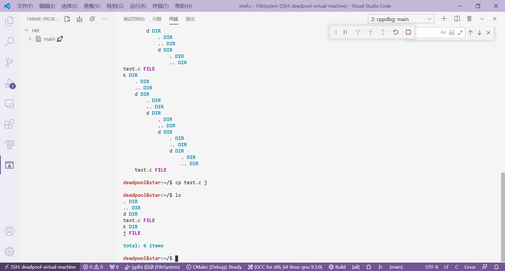

# A Simple Ext2 Based File System

> Author Deadpool

> Create in 2020-12-11

## Log

### 2020-12-15
- 需要完成rm、mv
- 最好能够完成多级索引块

### 2020-12-12
- 实现动态分配inode

## Support

- cp
- mkdir
- touch
- ls
- cd

## TODO
- tee
- cat
- remove unnecessary printf
- rm

## DEMO

### init

### ls

### mkdir and stru(structure which define by myself)

### touch

### tee and cat

### cd

### cp

### rm

### mv
